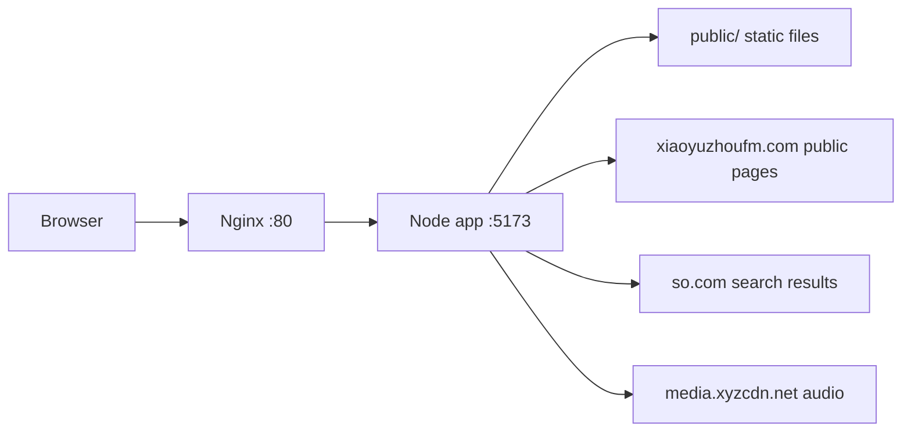

# PodcastDesk 项目规范与技术架构

## 项目定位

PodcastDesk 是一个第三方网页端播客播放器，当前服务地址为：

- `http://podcastdesk.cn/`
- `http://www.podcastdesk.cn/`
- 临时 IP：`http://175.178.130.174/`

项目目标是改善桌面浏览器端收听小宇宙公开播客的体验。当前只读取公开网页数据，不登录小宇宙账号，不处理私人订阅、播放历史、评论、付费内容或用户敏感数据。

## 当前上线策略

当前采用“中国大陆轻量服务器 + 域名 + HTTP”的临时上线方案：

- 云厂商：腾讯云轻量应用服务器
- 地域：广州
- 服务器：2 vCPU / 2 GB / 40 GB 系统盘 / 2 Mbps / 100 GB 月流量
- 公网 IP：`175.178.130.174`
- 域名：`podcastdesk.cn`
- Web 服务：Nginx 80 端口反向代理到本机 `127.0.0.1:5173`
- 应用进程：Docker Compose 管理的 Node.js 容器

HTTPS 暂缓。原因是大陆服务器绑定域名正式提供服务需要 ICP 备案，备案完成后再配置 HTTPS 和 80 到 443 跳转。

## 技术栈

- Runtime：Node.js 24
- 后端：Node.js 原生 `http` 服务，无框架依赖
- 前端：原生 HTML / CSS / JavaScript
- 测试：Node.js 内置 `node:test`
- 部署：Docker、Docker Compose、Nginx
- 源码托管：GitHub `Medesol/cosmos-desktop-player`

## 架构概览



## 后端模块

### `src/server.js`

职责：

- 托管 `public/` 静态文件
- 提供 `/api/search`
- 提供 `/api/podcast/:id`
- 提供 `/api/episode/:id`
- 提供 `/api/media?url=...` 音频代理
- 提供 `/api/config` 公开合规配置

音频代理只允许 `https://media.xyzcdn.net/...`，避免成为开放代理。

### `src/xiaoyuzhou.js`

职责：

- 解析小宇宙公开节目页和单集页中的 `__NEXT_DATA__`
- 规范化节目、单集和音频字段
- 支持小宇宙节目链接、单集链接和 24 位 ID 直达解析
- 通过公开搜索结果发现小宇宙节目页

设计边界：

- 不调用需要登录态的私有 API
- 不存储用户查询和播放行为
- 搜索结果可能受搜索引擎结果变化影响；直接粘贴小宇宙链接是稳定兜底路径

### `src/config.js`

职责：

- 从环境变量读取公开展示配置
- 当前用于 ICP 备案号和公安备案号展示

环境变量：

- `PUBLIC_ICP_TEXT`
- `PUBLIC_ICP_URL`
- `PUBLIC_SECURITY_RECORD_TEXT`
- `PUBLIC_SECURITY_RECORD_URL`

## 前端结构

### `public/index.html`

定义页面结构：

- 顶部搜索栏
- 节目列表
- 单集列表
- 底部播放器
- ICP/公安备案链接占位

### `public/app.js`

职责：

- 搜索节目
- 选择节目和单集
- 控制音频播放、暂停、进度、音量、倍速、上一集、下一集、自动连播
- 在音频直链失败时切换到 `/api/media` 代理

### `public/styles.css`

桌面优先布局，兼容窄屏。设计原则是工具型播放器：信息密度适中、控件清晰、避免营销式首页。

## 部署结构

### `Dockerfile`

构建 Node.js 运行镜像，复制 `public/` 和 `src/`，执行 `npm start`。

### `deploy/docker-compose.yml`

本机只绑定：

```text
127.0.0.1:5173 -> container:5173
```

这样公网只暴露 Nginx 80/443，应用容器端口不直接暴露到外网。

### `deploy/bootstrap-ubuntu-docker.sh`

用于 Ubuntu 服务器初始化：

- 安装或确认 Git、Nginx、Docker、Docker Compose
- 拉取仓库或更新仓库
- 构建并启动 Docker Compose
- 写入 Nginx 反向代理配置

大陆服务器访问 GitHub 不稳定时，使用本地 `git archive` 打包上传，再在服务器解压部署。

## 运维命令

服务器应用目录：

```text
/opt/cosmos-desktop-player
```

查看容器：

```bash
sudo docker ps --filter name=cosmos-desktop-player
```

查看日志：

```bash
sudo docker logs --tail 100 cosmos-desktop-player
```

重启服务：

```bash
cd /opt/cosmos-desktop-player
sudo docker compose -f deploy/docker-compose.yml up -d --build
sudo systemctl reload nginx
```

## 测试与发布规范

每次提交前运行：

```bash
npm test
npm run check
```

当前测试覆盖：

- 小宇宙节目页解析
- 小宇宙单集页解析
- 搜索结果链接提取
- 查询清洗
- 公开配置读取

发布到服务器后至少验证：

```bash
curl -I http://127.0.0.1/
curl http://127.0.0.1/api/config
curl -I http://podcastdesk.cn/
```

还要验证搜索接口和音频 Range 请求：

```text
/api/search?q=马刺进步报告
/api/media?url=<encoded media.xyzcdn.net URL>
```

## 安全与合规

- 当前服务为 HTTP 临时方案，适合小范围验收，不建议大规模公开推广。
- HTTPS 需要在域名备案后配置。
- 不使用小宇宙登录态，不采集用户账号数据。
- `/api/media` 限制为小宇宙公开音频域名，避免开放代理风险。
- 备案通过后应配置 `PUBLIC_ICP_TEXT` 和公安备案信息，并在页面底部展示。

## 后续路线

1. 完成 ICP 备案。
2. 配置 HTTPS 免费证书和 80 到 443 跳转。
3. 按播放流量决定是否升级带宽，或改成默认直链播放、代理兜底。
4. 增加收藏/最近播放等本地浏览器存储功能。
5. 探索更稳定的节目搜索来源，减少对搜索引擎结果页的依赖。
